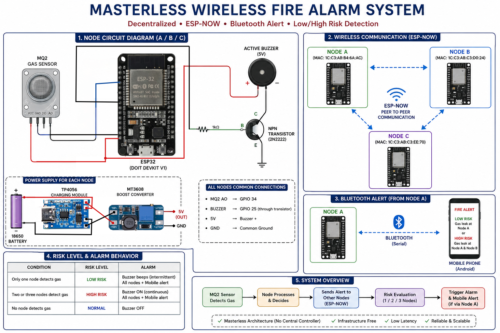

#  Masterless Wireless Fire Alarm System

A decentralized wireless fire detection and alert system using **ESP32, MQ2 gas sensors, ESP-NOW, and Bluetooth communication**.

##  Features
- Masterless architecture (No central controller)
- Peer-to-peer wireless communication using ESP-NOW
- Real-time gas/fire detection
- Multi-node risk classification
- Bluetooth mobile alerts
- Low latency emergency response
- No internet or Wi-Fi router required

---

##  System Architecture

---

##  Components Used

| Component | Quantity |
|------------|----------|
| ESP32 | 3 |
| MQ2 Sensor | 3 |
| Active Buzzer | 3 |
| Transistor | 3 |
| 1kΩ Resistor | 3 |
| TP4056 Module | 3 |
| MT3608 Boost Converter | 3 |
| 18650 Battery | 3 |

---

##  Working Principle

Each node continuously monitors gas levels using MQ2 sensors.

When gas is detected:

- **Single Node Detection → LOW RISK**
  - Intermittent beep
  - Alert message

- **Multiple Node Detection → HIGH RISK**
  - Continuous buzzer
  - Emergency alert

Node A sends real-time alerts to nearby mobile devices using Bluetooth.

---

##  Communication Used

### ESP-NOW
Used for:
- Node-to-node communication
- Real-time wireless transmission
- Low latency alert propagation

### Bluetooth
Used for:
- Mobile notification
- Nearby user alert system

---

##  Demo

### Low Risk
Gas leak detected at only one node.

### High Risk
Gas leak detected at multiple nodes.

---

##  Technologies Used
- Embedded Systems
- IoT
- ESP32
- Wireless Networking
- ESP-NOW
- Bluetooth Communication

---

##  Future Improvements
- Mesh networking
- BLE broadcast notifications
- Mobile App dashboard
- Cloud monitoring
- AI-based fire spread prediction